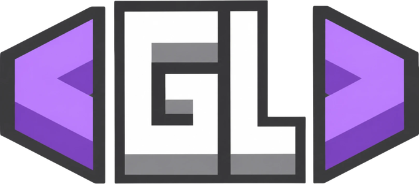

# GL Client

**GL Client** — кастомный клиент для [Mindustry](https://github.com/Anuken/Mindustry) (v8 / build 160).

Это форк двух клиентов:
- [Foo's Client](https://github.com/mindustry-antigrief/mindustry-client) (mindustry-antigrief) — основа: антигриф, навигация, автопередача, команды клиента и многое другое;
- **FD client** — боковая панель, логи действий игроков, авто-добыча юнитами, информация о волнах и карте, быстрые схемы, анализатор производства и другие инструменты.

Поверх них GL Client добавляет собственный интерфейс и доработки.

## Что есть в клиенте

- **Боковая панель GL** слева под волнами — вкладки «Добыча», «Отображение», «Бой», «Автоматика», «Сервер», все кнопки подписаны и оформлены в стиле интерфейса игры.
- Всё из Foo's Client: антигриф и логи тайлов, навигация и автоматика, автопередача предметов, клиентские команды (`!fixpower`, `!fixcode`, `!uc` и т.д.), связь между клиентами.
- Функции FD: логи игроков в реальном времени и по тайлам, авто-добыча и помощь в строительстве юнитами, умный прицел, информация о волнах и карте, быстрые схемы, анализ производства, оповещения о гибели ядер и массовых действиях с юнитами.

## Установка

1. Скачайте `MindustryGL.jar` из [Releases](../../releases) (или соберите сами, см. ниже).
2. Запустите:
   ```
   java -jar MindustryGL.jar
   ```
   Нужна Java 17 или новее.

Клиент хранит данные отдельно от обычной игры, в папке `MindustryGL` (на Windows — `%APPDATA%\MindustryGL`), так что ваши обычные сохранения и моды не пострадают.

## Сборка из исходников

```
git clone https://github.com/GLaziness/GL-Client
cd GL-Client
./gradlew desktop:dist
```

Готовый файл появится в `desktop/build/libs/Mindustry.jar`. Для запуска без сборки jar: `./gradlew desktop:run`.

## Благодарности и лицензия

- [Anuke](https://github.com/Anuken) — Mindustry.
- Команда [mindustry-antigrief](https://github.com/mindustry-antigrief/mindustry-client) — Foo's Client.
- Автор FD client — функции панели и инструменты FD.

Проект распространяется под лицензией [GNU GPL v3](LICENSE), как и Mindustry и Foo's Client.
