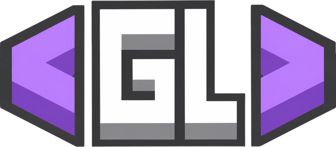

# GL Client

**GL Client** — кастомный клиент для [Mindustry](https://github.com/Anuken/Mindustry) (v8 / build 160).

Это форк двух клиентов:
- [Foo's Client](https://github.com/mindustry-antigrief/mindustry-client) (mindustry-antigrief) — основа: антигриф, навигация, автопередача, команды клиента и многое другое;
- **FD client** — боковая панель, логи действий игроков, авто-добыча юнитами, информация о волнах и карте, быстрые схемы, анализатор производства и другие инструменты.

Поверх них GL Client добавляет собственный интерфейс и доработки.

## Что есть в клиенте

- **Боковая панель GL** слева под волнами — вкладки «Добыча», «Отображение», «Бой», «Автоматика», «Сервер», все кнопки подписаны и оформлены в стиле интерфейса игры.
- Всё из Foo's Client: антигриф и логи тайлов, навигация и автоматика, автопередача предметов, клиентские команды (`!fixpower`, `!fixcode`, `!uc` и т.д.), связь между клиентами.
- Функции FD: логи игроков в реальном времени и по тайлам, авто-добыча и помощь в строительстве юнитами, умный прицел, информация о волнах и карте, быстрые схемы, анализ производства, оповещения о гибели ядер и массовых действиях с юнитами.

### Доработки GL

- **ИИ добычи юнитами**: таблица «какой тип юнита какую руду копает», распределение по нехватке ресурсов, безопасная копка (жилы под вражескими турелями обходятся, юниты перелетают к такой же руде у другого ядра, экстренно отходят из-под огня), повреждённые юниты сами летят на ремонт, помощь в стройке по типам юнитов, команды периодически повторяются, чтобы юниты не простаивали.
- **Круговой assist** с маршрутами (круг, квадрат, звезда, линия, восьмёрка) и обходом вражеских турелей.
- **Мосты в обход препятствий**: протяжка мостового конвейера с зажатым Ctrl ведёт линию мимо стен и построек — мост перекидывается прямо через конвейеры, узел не встаёт на занятую клетку, мостов ставится минимум.
- **Мосты для пластанового конвейера**: пересечённые конвейеры и трубы сами получают мосты, при многих линиях — фазовые мосты с силовыми узлами.
- **Режим поли**: ваш юнит сам отстраивает разрушенное, помогает строить и лечит, а без работы может уходить копать (АФК-копка).
- **Новы и Парусы помогают строить**: одна кнопка отправляет их помогать игрокам в стройке (по ПКМ — выбрать тип), при выключении они возвращаются к прежней команде.
- **Скрытие курсора** от других игроков и **полупрозрачность** своего юнита.
- **Меню Alt + ЛКМ** по клетке: координаты в чат, логи клетки, телепорт, окна клиента и переключатели.
- Кнопки панели запоминают состояние; часть кнопок по ПКМ работает автоматически (голосования, соединение энергосетей раз в минуту).
- **Цветной чат**: обычный цвет, градиент, радуга и «огонь» с выбором цветов в палитре; длинные сообщения аккуратно делятся по словам с сохранением цвета.
- Следующая волна в чат, отключение скрытия деталей при отдалении, переключатели логов в настройках.
- **Глобальный чат GL** через свой сервер: общий чат всех игроков GL Client и отдельный чат сервера, общий для всех его режимов. Работает через `!g` / `!gs`, режимы по Tab и плавающее окно (Alt + ЛКМ) со вкладками. Цветные ники, метки, которые нельзя подделать, модерация (владелец, кураторы, модераторы серверов) с мьютами и банами. Справка: `!ghelp`.
- **Рекомендуемые дополнения** в меню GL Client и в меню паузы: установка мода GL Admin Mode и включение глобального чата.
- Обмен планами постройки с игроками на Foo's и GL Client — в настройках, включён по умолчанию.
- Админам: мод [GL Admin Mode](https://github.com/GLaziness/GL-AdminMode) (список игроков, быстрый бан, антигрифер) — его панель встаёт под боковой панелью GL.
- Клиент полностью на русском: интерфейс, настройки, команды, окна FD, логи блоков и сообщения модерации.
- Подсказка при наведении на блок показывает иконки блоков вместо названий, чтобы быть компактнее.

## Установка

> **Это не мод.** `MindustryGL.jar` — отдельная сборка игры. Не кладите его в папку `mods` и не открывайте через «Импорт мода»: игра не найдёт внутри `mod.json` и напишет `No mod.json found`. Мод для админов — это [GL Admin Mode](https://github.com/GLaziness/GL-AdminMode), а не клиент.

1. Скачайте `MindustryGL.jar` из [Releases](../../releases) (или соберите сами, см. ниже).
2. Запустите:
   ```
   java -jar MindustryGL.jar
   ```
   Нужна Java 17 или новее.

Клиент хранит данные отдельно от обычной игры, в папке `MindustryGL` (на Windows — `%APPDATA%\MindustryGL`), так что ваши обычные сохранения и моды не пострадают.

## Запуск поверх версии из Steam

Клиент можно подложить в стимовую копию игры — тогда работают оверлей, достижения, мастерская и приглашения от друзей из Steam. Отдельным приложением в Steam клиент не выходит и выходить не может.

1. Скачайте `MindustryGL-steam.jar` из [Releases](../../releases) — это та же сборка, но с библиотеками Steam внутри.
2. В папке игры (`...\steamapps\common\Mindustry`) переименуйте `jre\desktop.jar` в `desktop.jar.vanilla`, а скачанный файл положите на его место под именем `desktop.jar`.
3. Запускайте игру как обычно, через Steam.

Если собираете сами, всё это сделает одна команда — папку Steam она найдёт сама, оригинал сохранит рядом:

```
./gradlew desktop:steamInstall -Prelease -PversionModifier=steam
```

Вернуть обычную игру: `./gradlew desktop:steamRestore`. Папку можно указать вручную: `-PsteamDir="C:/.../steamapps/common/Mindustry"`.

Два предупреждения. В стимовом варианте сохранения и настройки лежат в папке игры (`saves`), то есть общие с обычной Mindustry, а не отдельные. И Steam возвращает свой файл при каждом обновлении игры и при проверке целостности файлов — после этого подмену надо повторить.

## Сборка из исходников

```
git clone https://github.com/GLaziness/GL-Client
cd GL-Client
./gradlew desktop:dist
```

Готовый файл появится в `desktop/build/libs/Mindustry.jar`. Для запуска без сборки jar: `./gradlew desktop:run`.

## Благодарности и лицензия

- [Anuke](https://github.com/Anuken) — Mindustry.
- Команда [mindustry-antigrief](https://github.com/mindustry-antigrief/mindustry-client) — Foo's Client.
- Автор FD client — функции панели и инструменты FD.
- Клиент Morj — идеи и часть функций (ремонт юнитов, полупрозрачность, круговой assist и др.).

Проект распространяется под лицензией [GNU GPL v3](LICENSE), как и Mindustry и Foo's Client.
